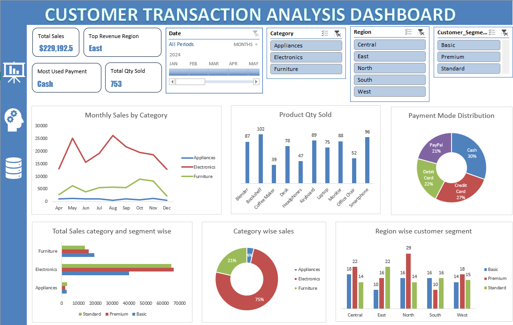

# 📊 Customer Transaction Analysis Dashboard

<div align="center">


**An end-to-end business intelligence project analyzing $229K+ in customer transactions across regions, product categories, and customer segments — with a fully interactive Excel dashboard and a strategic insights report.**

</div>

---

## 🖼️ Dashboard Preview



> *Interactive Excel dashboard with slicers for Date, Category, Region, and Customer Segment — giving stakeholders a 360° view of business performance.*

---

## 🚀 Project Overview

This project simulates a real-world business intelligence workflow: raw transactional data is cleaned, modeled, and transformed into an executive-ready dashboard and a comprehensive intelligence report. The goal is to surface **actionable insights** — not just charts.

| KPI | Value |
|-----|-------|
| 💰 Total Revenue | **$229,192.47** |
| 📦 Total Quantity Sold | **753 units** |
| 🏆 Top Revenue Region | **East — $59,288** |
| 🏆 Top Transaction Region | **North — 59** |
| 🥇 Top Customer Segment | **Premium — $84,657** |
| 🧾 Average Order Value | **$916.77** |
| 💳 Most Used Payment Mode | **Cash (30%)** |

---

## 📁 Project Structure

```
📦 customer-transaction-analysis/
├── 📊 customer_transaction_analysis.xlsx   # Raw data + Pivot Tables + Dashboard
├── 📄 Insights_report.pdf                  # Full strategic intelligence report
├── 🖼️ dashboard.png                        # Dashboard screenshot
└── 📝 README.md                            # You are here
```

---

## 🔍 Key Insights Uncovered

### 1. 🗺️ The "Volume vs. Value" Geographic Split
- **North** leads in transaction *volume* (59 orders) but has a lower AOV
- **East** leads in total *revenue* ($59,288) driven by high-ticket electronics purchases
- → Two distinct buyer behaviors requiring **bifurcated marketing strategies**

### 2. 📱 Revenue is Highly Concentrated in Two Products
- **Laptops** ($67,499) + **Smartphones** ($67,199) account for **~59% of total revenue**
- Blenders and Keyboards drive volume in the North but contribute minimally to revenue
- → Inventory and ad spend should **double down on the electronics category**

### 3. 🏅 The Premium–Standard Segment Gap is Closing
| Segment | Revenue |
|---------|---------|
| Premium | $84,657 |
| Standard | $82,357 |
| Basic | $62,178 |

- Standard customers are only **$2,300 behind** Premium — a conversion opportunity
- Top individual spenders (Mark Carter: $15.6K, Edward Mitchell: $11.9K) behave like wholesale accounts

---

## 📊 Dashboard Features

| Feature | Details |
|--------|---------|
| 📅 **Date Slicer** | Filter by month — tracks seasonality (Apr–Dec 2024) |
| 🗂️ **Category Filter** | Appliances / Electronics / Furniture |
| 🌍 **Region Filter** | Central / East / North / South / West |
| 👤 **Segment Filter** | Basic / Premium / Standard |
| 📈 **Monthly Sales Trend** | Line chart tracking category-wise revenue over time |
| 📦 **Product Qty Sold** | Bar chart comparing unit sales across all 10 products |
| 🍩 **Payment Mode Distribution** | Donut chart (Cash 30%, Credit 27%, Debit 22%, PayPal 21%) |
| 📊 **Segment × Category Sales** | Horizontal bar chart showing revenue breakdown |
| 🥧 **Category Share** | Pie chart — Electronics dominates at 75% |
| 🏙️ **Region × Segment Heatmap** | Clustered bar comparing segment performance per region |

---

## 🛠️ Tools & Techniques Used

- **Microsoft Excel** — Data cleaning, Pivot Tables, Slicers, Chart design
- **Dashboard Design** — KPI cards, interactive slicers, multi-chart layout
- **Business Report Writing** — Executive summary, data storytelling, strategic recommendations

---

## 💡 Strategic Recommendations (from Report)

1. **North Region** → Launch upsell/bundle campaigns at checkout to increase AOV
2. **East Region** → Reallocate digital ad spend to acquire more high-value electronics buyers
3. **Standard Segment** → Build a VIP conversion campaign: "Spend $1,000+ = Premium upgrade"
4. **Top VIP Clients** → Assign dedicated account managers to the top 10 spenders for loyalty retention

---

## 📌 What This Project Demonstrates

- ✅ End-to-end data analysis workflow (raw data → insight → recommendation)
- ✅ Excel dashboard design with interactivity and visual hierarchy
- ✅ Business storytelling and executive report writing
- ✅ Customer segmentation and geographic performance analysis
- ✅ Revenue concentration analysis (Pareto-style product breakdown)
- ✅ Payment behavior profiling

---

## 🙋‍♂️ About

Built as a portfolio project to demonstrate **business intelligence, data analysis, and dashboard design skills**. All data is synthetic and generated for analytical purposes.

<div align="center">

If you found this useful, please ⭐ **star the repo** and feel free to connect!

[](https://www.linkedin.com/in/chirag-modi-3001rookie)
[](https://github.com/Rookie010101)
[](mailto:chiragmodi2027@gmail.com)

</div>
